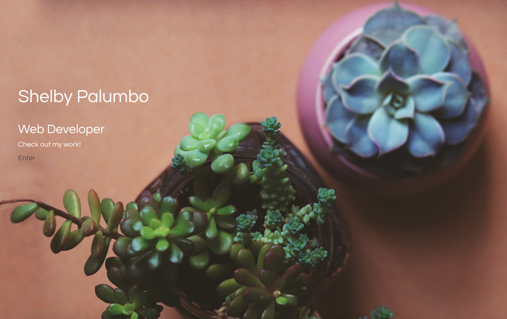

# Shelby-Palumbo-React-Portfolio

Deployed Website: https://shelbypalumbo.github.io/Shelby-Palumbo-React-Portfolio

## User Story

As a Full Stack Developer I want to showcase my past, present, and future professional work, so that I can network and find new career opportunities in the development world.

### Usage

My portfolio includes an about me section, a professional resume, a gallery, and links to projects showcasing my work.

## Programming Languages Used

- React
- JSX
- HTML
- CSS
- JavaScript
- JQuery

### Additional Styling Framework & Resources

- Bootstrap | https://getbootstrap.com/
- Fontsawesome icons | https://fontawesome.com/icons?d=gallery&m=free
- Google Fonts | https://fonts.google.com/?selection.family=Odibee+Sans
- Tinypng | https://tinypng.com/
